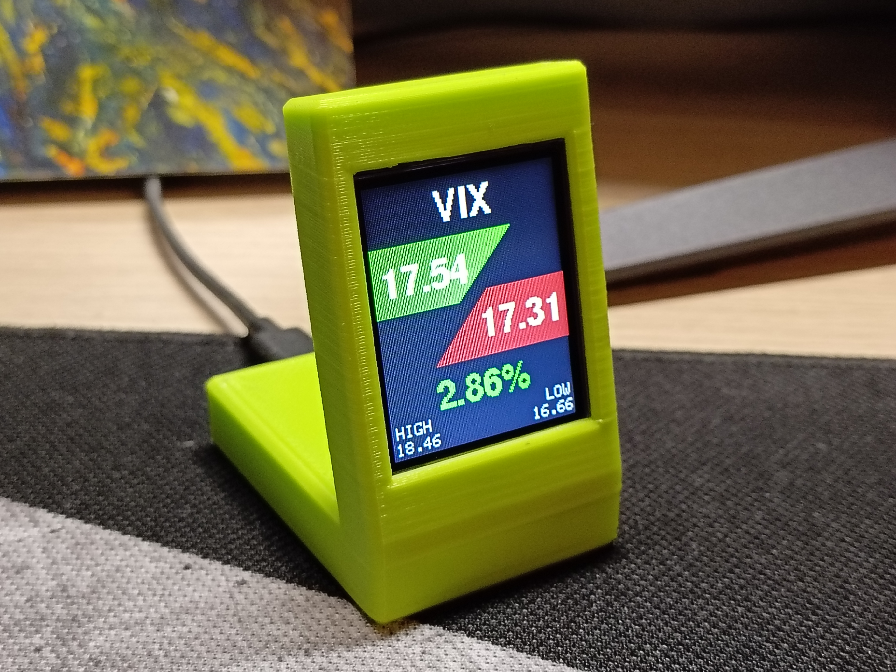
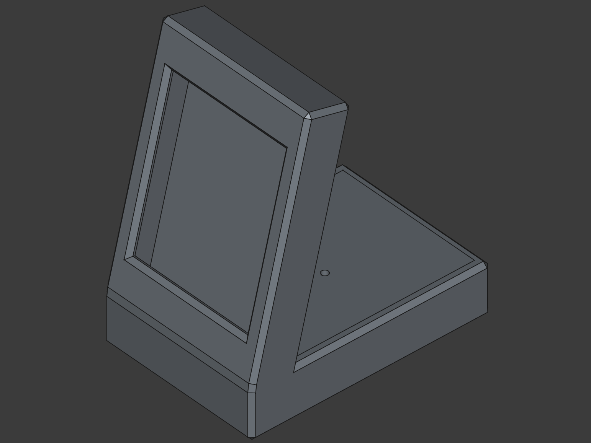
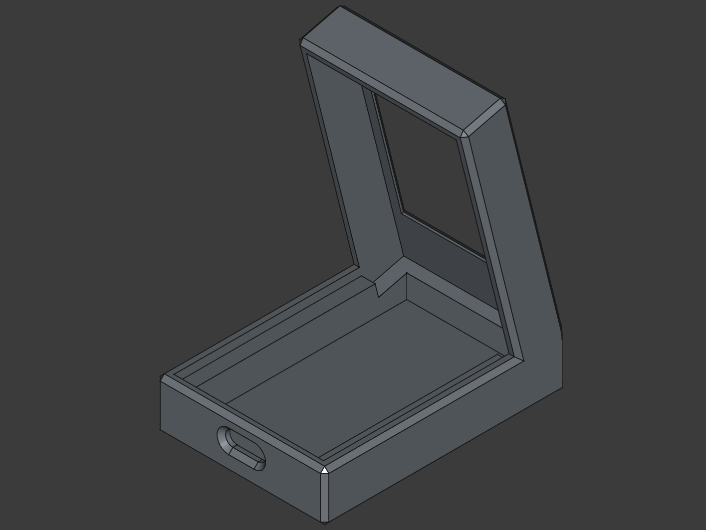

# VIX ESP32 Ticker
ESP32 based VIX ticker with LCD display

# Requirements
 - ESP-32S WROOM-32 WiFi
 - TFT LCD 1.8 ST7735 Display
 - 3D printer to print case
 - Momentary Pushbutton Switch - 12mm Square

# Wiring

Wiring between  ESP32 and ST7735
 - GND -> GND
 - VCC -> 3.3
 - SCL -> D18 (SCLK)
 - SDA -> D23 (MISO)
 - RES -> D16
 - DC  -> D15
 - CS  -> D2
 - BL  -> D12

Wiring between ESP32 and button
 - LEG1 -> GND
 - LEG2 -> D13

USB-C is used for power delivery.

# Code

Due to this particular VIX values being used only by certain Marker Makers (MM) brokers and not in financial APIs, they are obtained by reading data directly from webiste in intervals specified in <code>timerDelay</code> variable. To connect to your WiFi <code>ssid</code> and <code>password</code> variables must be supplemented. Push button for 1 second do disable LCD screen without powering off devie.

# STL Model

Case consists of two parts, main case and back panel. Switch is pressfitted into back panel. Gap over the screen cut-out can be hard to print without sagging, it is advised to print this part with supports enabled.

